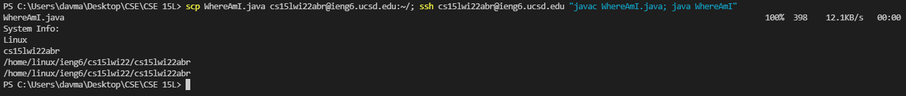

# Lab Report 1

Hello, future CSE 15L student! This tutorial will cover remote access to a course-specific account on `ieng6`.

Contents: 

1. [Installing VS Code](#installing-vs-code)
2. [Remotely Connecting](#remotely-connecting)
3. [Trying Some Commands](#trying-some-commands)
4. [Moving Files with `scp`](#moving-files-with-scp)
5. [Setting an SSH Key](#setting-an-ssh-key)
6. [Optimizing Remote Running](#optimizing-remote-running)

## Installing VS Code

[Download](https://code.visualstudio.com/download) the correct option for your operating system (Windows, Linux, or Mac). If I'm on a Windows machine, for example I should download the VS Code installer for Windows and open the `.exe` file in File Explorer. When installation is finished, open VS Code. Open a new terminal using the menu at the top (Terminal > New Terminal).


## Remotely Connecting

### Set up your course-specific account

Find your course-specific account using the [Account Lookup tool](https://sdacs.ucsd.edu/~icc/index.php). Under "Additional Accounts," locate your account for CSE 15L (username begins with `cs15lwi22`). Click on the account to change its password.

### Using `ssh`

If you're on Windows, [install OpenSSH](https://docs.microsoft.com/en-us/windows-server/administration/openssh/openssh_install_firstuse) (follow "Installing SSH using Windows Settings").

Using your username from the previous step, run `ssh <username>@ieng6.ucsd.edu` in the VS Code terminal. Replace the `<>` and anything between them with your information. Enter your password. If prompted, "`Are you sure you want to continue...`", type `yes`.


## Trying Some Commands

After connecting SSH, you can remotely run commands on the server. Try some of these commands on the server (finally, *colors*!):  

- `cd ~`
- `cd`
- `ls -lat`
- `ls -a`
- `ls /linux/ieng6/<another group member's username>/`
- `cp /home/linux/ieng6/cs15lwi22/public/hello.txt ~/`
- `cat /home/linux/ieng6/cs15lwi22/public/hello.txt`


Use the command `exit` or press `Ctrl + D` to log out of the remote server. Try the commands listed above on your computer if you have time.

## Moving Files with `scp`

Connect to the remote server with ssh again (press the up arrow to find previous commands). The command `scp <file name> <username>@ieng6.ucsd.edu:<directory on server>` moves a file in the working directory on the client to any directory on the `ieng6` server. 

Make a new file in VS Code named `WhereAmI.java` using the file explorer on the left, add the class below, and move it to the server's home directory (`~/`):  

```java
class WhereAmI {
  public static void main(String[] args) {
    System.out.println(System.getProperty("os.name"));
    System.out.println(System.getProperty("user.name"));
    System.out.println(System.getProperty("user.home"));
    System.out.println(System.getProperty("user.dir"));
  }
}
```


Next, compile and run the Java file on both client and server.


## Setting an SSH Key
On the client, run `ssh-keygen` to create a public-private pair of SSH keys. If you're on Windows, follow the instructions for [`ssh-add`](https://docs.microsoft.com/en-us/windows-server/administration/openssh/openssh_keymanagement#user-key-generation) under "User key generation". Make sure to run this in Powershell as an administrator *after* you make new SSH keys.


Copy the public SSH key at `<user account>/.ssh/id_rsa.pub` on your machine to the directory `~/.ssh/authorized_keys` on the server with the command:

`scp <user account>/.ssh/id_rsa.pub <username>@ieng6.ucsd.edu:~/.ssh/authorized_keys`.

Try using `ssh` and `scp` from this client without using your password.


## Optimizing Remote Running
Commands can be chained (run one after another) using a semicolon. We can run a command on the server (after connecting with SSH) by immediately enclosing it in double quotes (no semicolon after `ssh`).

This command copies WhereAmI.java to the home directory on the server (overwriting an existing version) and runs the file on the server: 

`scp WhereAmI.java cs15lwi22abr@ieng6.ucsd.edu:~/; ssh cs15lwi22abr@ieng6.ucsd.edu "javac WhereAmI.java; java WhereAmI"`

I was able to save 9 keystrokes total by chaining commands together. Without chaining, it would take 127 keystrokes (including clicks), versus 118 with chaining.


