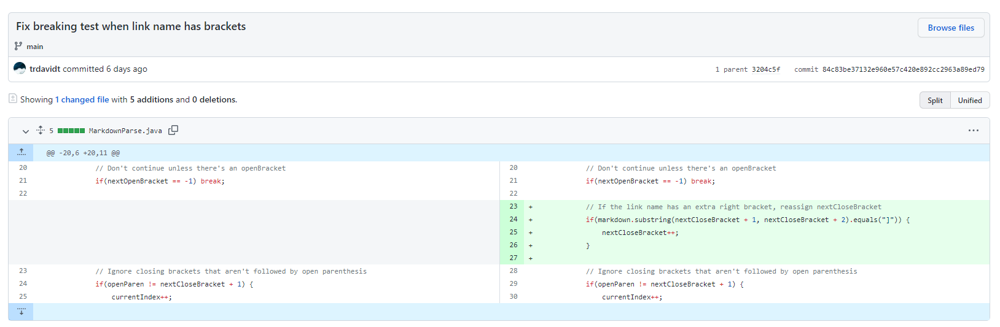

# Lab Report 2

## Failure-Inducing Input 1

Test file with failing input: [test-file4.md](https://github.com/trdavidt/markdown-parse/blob/main/test-file4.md)

The fourth test failed with our previous `getLinks` method from Week 3. The symptom was an unexpected output (`"]link goes here"` instead of `"[]"`). The bug behind this symptom was not checking if a link was valid (had a `"."`) before adding it to `toReturn`.

## Failure-Inducing Input 2

Test file with failing input: [test-file7.md](https://github.com/trdavidt/markdown-parse/blob/main/test-file7.md)

The seventh test for `test-file7.md` failed. The symptom was an infinite loop. The bug behind this symptom was not exiting the loop in `getLinks` when the file had no closed bracket to follow an open bracket on the last line. We changed our approach to parsing links by looking for periods first and stopping at brackets, parentheses, or new lines to fix the test 7 bug.

## Failure-Inducing Input 3

Test file with failing input: [test-file8.md](https://github.com/trdavidt/markdown-parse/blob/main/test-file8.md)

The eighth test failed with the file `test-file8.md`. The symptom was identical to the seventh test's symptom (an infinite loop). This was probably the same bug as the previous failure-inducing test, since both files ended with an open bracket. The fix was identical, both tests passed when we rewrote the `getLinks` methods with a different approach.

## Failure-Inducing Input 4

In case the third one doesn't count (it's really similar to the second failure-inducing input), here's another, but from the Week 3 lab.

Test file with failing input: [more-tests.md](https://github.com/trdavidt/markdown-parse/blob/main/more-tests.md)

The symptom here was printing out the link name instead of getting the link. The corresponding bug was failing to check for an extra right bracket in the link name before adding the link to `toReturn`.

