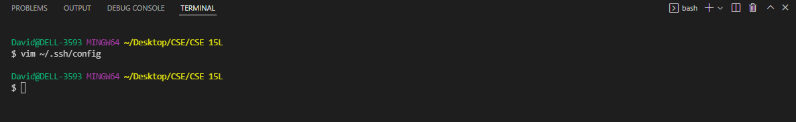
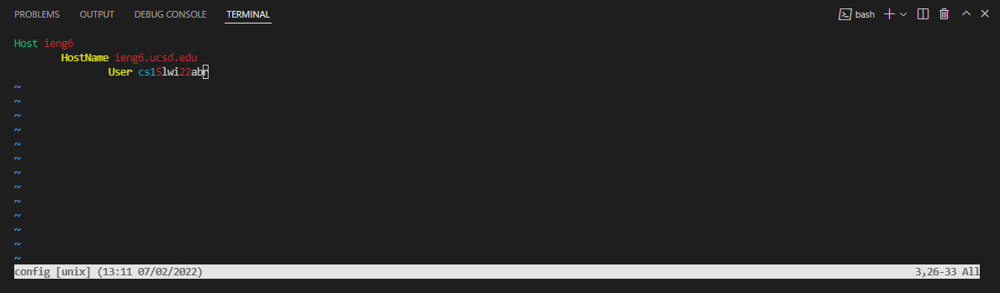
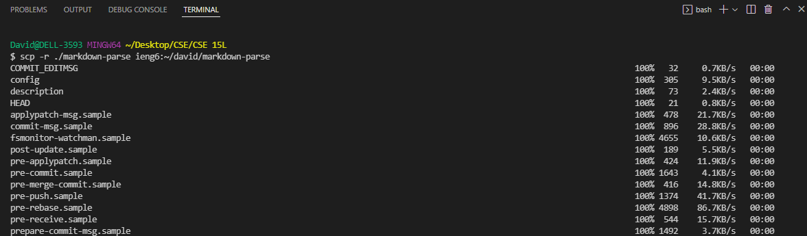
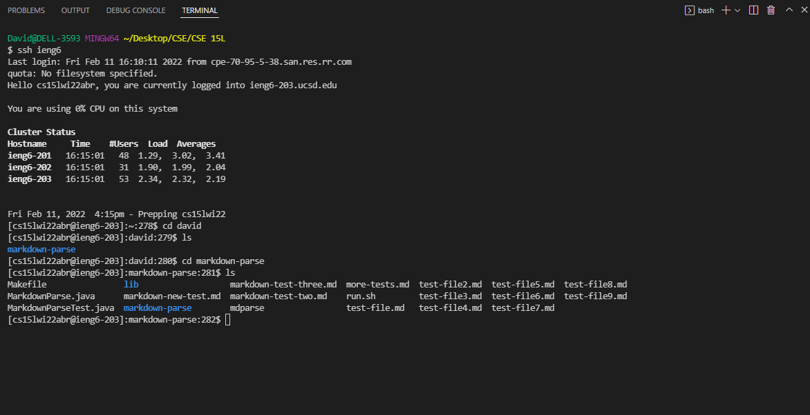

# Lab Report 3

## Streamlining `ssh` Configuration

I edited my SSH config file (at `~/.ssh/config`) using vim in the terminal.

I followed my lab group's tutor's instructions for vim and typed `i` to insert new lines in the file and `Esc`, then `:wq` to save the changes and quit vim.

To make sure the new alias works for `ssh`, I copied the `markdown-parse` directory to `ieng6` and logged in to `ieng6` to check.

