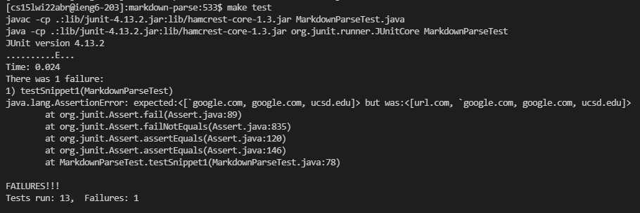
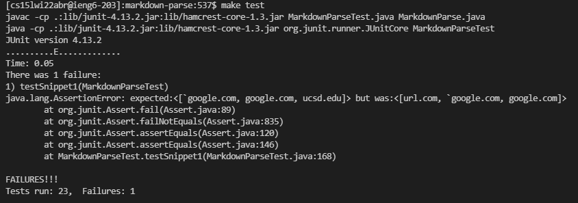
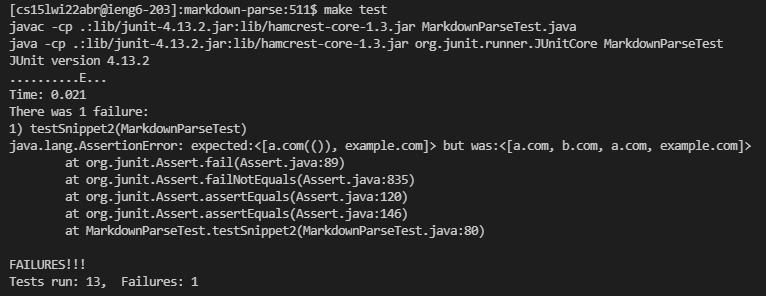
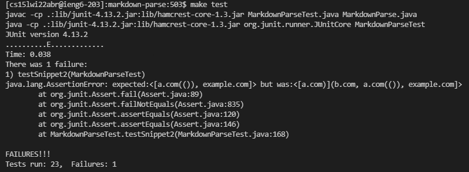
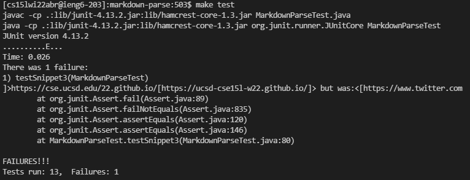
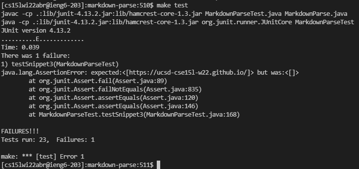

# Lab Report 4

I'm using VSCode's Markdown Preview feature to determine the expected outpout (links) from the Markdown snippets below. Here is [my `markdown-parse` repository](https://github.com/trdavidt/markdown-parse) and the [repo my group reviewed](https://github.com/bimai25/markdown-parse-brandon).

## Snippet 1

```Markdown
`[a link`](url.com)

[another link](`google.com)`

[`cod[e`](google.com)

[`code]`](ucsd.edu)
```

Expected output: ```[`google.com, google.com, ucsd.edu]```

Corresponding JUnit test:

```java
@Test
public void testSnippet1() throws IOException {
    Path fileName = Path.of("./lab-report-4-test-1.md");
    String contents = Files.readString(fileName);
    assertEquals(List.of("`google.com", "google.com", "ucsd.edu"), 
        MarkdownParse.getLinks(contents));
}
```

### My Code

Output:



Suggested fix: I don't think there is a short fix for cases involving backticks wrapping around one of the brackets. `getLinks` looks for anything between a pair of parentheses that enclose a `.`, which is not able to recognize if the link name is valid (enclosed in brackets without backticks around a bracket).

### Reviewed Code

Output:



Suggested fix: The method `isOfLinkForm` does not account for cases involving backticks within the link brackets. I think a short fix would be to `&&` the boolean ```!s.startsWith('`')```.

## Snippet 2

```Markdown
[a [nested link](a.com)](b.com)

[a nested parenthesized url](a.com(()))

[some escaped \[ brackets \]](example.com)
```

Expected output: ```[a.com(()), example.com]```

Corresponding JUnit test:

```java
@Test
public void testSnippet2() throws IOException {
    Path fileName = Path.of("./lab-report-4-test-2.md");
    String contents = Files.readString(fileName);
    assertEquals(List.of("a.com(())", "example.com"),          
        MarkdownParse.getLinks(contents));
}
```

### My Code

Output:



Suggested fix: There is no short code change for this case because the `getLinks` method is making too many generalizations about the position of parentheses to parse the expected links. To start, there should not be a list of `stopCharacters` to handle this case, since using a link address like `a.com(())` would be read starting from the dot going back to `a` and forward to stop at `m` (in `com`). Since the first `.` in the first line of the test file is the inner nested link, the link `a.com` is parsed when there isnt't be a link with the name `a \[nested link\](a.com)`.

### Reviewed Code

Output:



Suggested fix: From the terminal output, the program thinks the nested link at the top of the file is valid. There isn't a short fix. The implementation of the method `checkLinkContainer` is an issue for this case because it looks for the outermost pair of brackets and parentheses, so it considers the first line in the test file to be a link with name `a [nested link]` and address `a.com)](b.com`. Many local variables and conditional statements in the loop need to be changed.

## Snippet 3

```Markdown
[this title text is really long and takes up more than 
one line

and has some line breaks](
    https://www.twitter.com
)

[this title text is really long and takes up more than 
one line](
    https://ucsd-cse15l-w22.github.io/
)


[this link doesn't have a closing parenthesis](github.com

And there's still some more text after that.

[this link doesn't have a closing parenthesis for a while](https://cse.ucsd.edu/


)

And then there's more text
```

Expected output: `[https://ucsd-cse15l-w22.github.io/]`

Corresponding JUnit test:

```java
@Test
public void testSnippet3() throws IOException {
    Path fileName = Path.of("./lab-report-4-test-3.md");
    String contents = Files.readString(fileName);
    assertEquals(List.of("https://ucsd-cse15l-w22.github.io/"),          
        MarkdownParse.getLinks(contents));
}
```

### My Code 

Output: 



Suggested fix: There's no short fix again. The `getLinks` method is designed to parse one link per line. This is something another group pointed out about my (group's) implementation during our code review. Naturally, when a link includes `\n` characters on either side of the `.` in the link address, the program stops prematurely does not recognize the CSE 15L website link. This would require rewriting or possibly combining the loops in `getLinks` and finding an alternative to using a list of `stopCharacters`.

### Reviewed Code

Output:



Suggested fix: Since this implementation first splits the file into a `contentArray` based on a newline character, a possible fix would be to split the file contents based on spaces. This way, the valid link address enclosed by newlines can be parsed. An `if` statement can be added to remove newlines between `()` in `checkLinkContainer`.